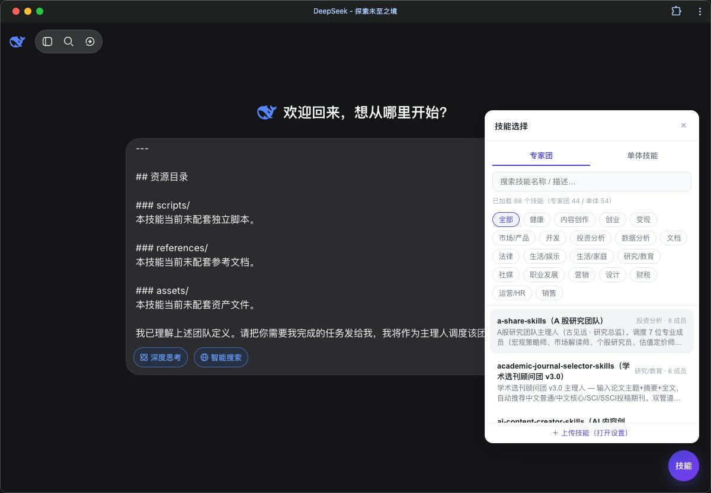
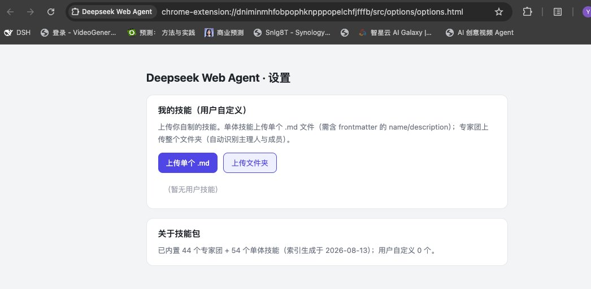

# Deepseek Web Agent（DsBrowserHelper / DsWebChromeAgent）

<div align="center">

[English](README_EN.md) | **简体中文**

[](manifest.json)
[](LICENSE)
[](skills/index.json)
[](#-支持站点矩阵)

**一键为 DeepSeek、ChatGPT、Kimi、豆包、Gemini 等 AI 网页注入 90+ 专业专家团与单体技能，零 API 成本将普通对话升级为多角色协同工作台！**

</div>

---

## 📖 简介

**Deepseek Web Agent（DsBrowserHelper）** 是一款基于 Chrome Extension (Manifest V3) 开发的浏览器扩展。

在主流 AI 对话网站（如 DeepSeek、Kimi、豆包、ChatGPT、Gemini、通义千问等）中，右下角自动注入一个极简的「**技能**」浮动按钮。点击后可快速挑选 **44 组多角色协同专家团**、**54 个单体专业技能** 或 **自定义私有技能**。扩展会自动将经过结构化包装的**引导提示词 + 技能正文**注入到底层聊天输入框，只需一键发送，AI 即可立即化身为专业领域的主理人或专家团队协同作业！

### 📸 实机界面展示

#### 1. AI 网页对话端 · 专家团/技能面板与一键注入（以 DeepSeek 为例）
> 右下角浮动面板快速筛选/搜索 98+ 技能，点击一键注入规范的主理人引导词与多专家角色定义。



#### 2. 扩展管理后台 · 用户自定义技能上传与管理
> 支持自由上传单个 `.md` 技能文件或整个专家团文件夹，即时同步至浮动面板并本地持久化存储。



---

## ✨ 核心特性

- 👥 **44 组多角色协作「专家团」**
  - 内置如 *AI 对冲基金投资大师（21 角色）*、*A股投研专家团（7 角色）*、*MVP 全栈开发团（7 角色）*、*深度研究团队*、*法律合规团*、*视频创作制作组* 等。
  - 自动组织主理人与专家成员定义，按标准化 SOP 工作流（圆桌讨论、多角度评审、阶段交付）协作输出。
- 🎯 **54 个实用「单体技能」**
  - 涵盖文档级处理（Word docx、PDF 分析提取、PPTX 制作、Excel 数据建模）。
  - 官方 Anthropic 技能体系（前端设计、UI 审查、Web 测试）+ 豆包/飞书高效协同套件（小说撰写、短视频剧本、公文撰写、飞书文档/多维表格）。
- 🚀 **智能引导词包装（Prompt Wrapper）**
  - 注入内容并非裸提示词，而是经过严格调优的「引导模板 + 运行环境说明 + 技能正文」。
  - 针对 Web 对话环境（无终端/无脚本执行权限）做了专门的行为对齐，引导 AI 在对话窗口内完整扮演与模拟交付。
- 📁 **开放的用户自定义技能生态**
  - 设置页一键导入单个 `.md` 技能，或上传包含主理人与多角色的文件夹。
  - 基于 `chrome.storage` 本地安全持久化存储，与内置技能无缝合并显示。
- 📥 **单条回答 & 整场对话文档导出（Markdown / Word / PDF）**
  - 针对 DeepSeek 等不支持导出的网页，在回答底部的 `[分享]` 旁自动注入 `[📄 导出 ▾]` 按钮。
  - 支持将单条消息或整场会话导出为干净排版的 `.md`、`.doc` 以及带分页打印预览的 `.pdf`。
- 🌐 **全方位多站点适配与一键唤醒**
  - 深度原生适配主流大模型网页端，精准适配不同站点的富文本/Textarea 输入框。
  - 对未预设匹配的任何网页，可在工具栏 Popup 中一键「在此页面启用插件」，自动挂载通用富文本/输入框适配器。
- ⚡ **零 API Key · 零服务器中转 · 100% 隐私安全**
  - 纯前端 Client-Side 注入，不经过任何第三方中转服务器，不消耗昂贵的 API Token，安全合规。
- 🔍 **分类检索与即时搜索**
  - 支持按拼音、关键词实时过滤，按「投资分析、开发、内容创作、法律、财税、营销、设计」等 15+ 分类秒级筛选。

---

## 🌐 支持站点矩阵

扩展已原生适配以下主流平台，并在打开对应页面时自动激活：

| 平台名称 | 适配域名 | 唤醒方式 |
| :--- | :--- | :--- |
| **DeepSeek** | `chat.deepseek.com` | 自动唤醒 |
| **Kimi** | `kimi.moonshot.cn`, `kimi.com` | 自动唤醒 |
| **豆包 (Doubao)** | `doubao.com` | 自动唤醒 |
| **ChatGPT** | `chatgpt.com`, `chat.openai.com` | 自动唤醒 |
| **Google Gemini** | `gemini.google.com` | 自动唤醒 |
| **通义千问 (Qwen)** | `tongyi.aliyun.com`, `qianwen.aliyun.com` | 自动唤醒 |
| **智谱清言 (GLM)** | `chatglm.cn` | 自动唤醒 |
| **腾讯元宝 (Yuanbao)** | `yuanbao.tencent.com` | 自动唤醒 |
| **百度文心一言 (Ernie)** | `yiyan.baidu.com` | 自动唤醒 |
| **其他任意网页 / AI 平台** | 任意 URL | 点击扩展图标 → **「在此页面启用插件」** |

---

## 🚀 安装与使用

### 方式 1：直接加载运行（推荐）

1. **下载 / 克隆仓库**：
   ```bash
   git clone https://github.com/darker2016/DsWebChromeAgent.git
   ```
2. **在 Chrome 中加载扩展**：
   - 打开 Chrome 浏览器，访问 `chrome://extensions/`。
   - 勾选右上角的 **「开发者模式」 (Developer mode)**。
   - 点击左上角的 **「加载已解压的扩展程序」 (Load unpacked)**。
   - 选择刚刚克隆的项目根目录 `DsWebChromeAgent` 即可。
3. **开始使用**：
   - 打开 [chat.deepseek.com](https://chat.deepseek.com) 或其他支持的 AI 对话页。
   - 看到右下角的 **「技能」** 按钮，点击展开技能选择浮窗。
   - 选择或搜索你需要的专家团/技能，点击 **「插入」**。
   - 引导提示词自动填入输入框，直接发送即可开始专业协同！

---

### 方式 2：开发者构建与技能同步（可选）

如需二次开发或同步更新上游开源技能包：

```bash
# 1. 安装与同步技能包
bash scripts/sync-skills.sh          # 同步本地 WorkBuddySkillGroups 专家团
bash scripts/fetch-single-skills.sh  # 从 GitHub 抓取单体技能 (anthropics/skills & doubao-skill-and-info)
node scripts/build-index.js          # 重新生成 skills/index.json 注册表

# 2. Chrome 扩展管理页面点击「刷新」按钮更新
```

---

## 🗂 技能生态导览

### 1. 专家团（共 44 组，支持多角色与工作流协同）

| 领域 | 专家团名称示例 | 包含角色与能力简要 |
| :--- | :--- | :--- |
| **投资分析** | AI 投资大师专家团 (`investment-masters-skills`) | 贺知衡主理人，汇聚 21 位传奇投资大师、分析师与风控专家 |
| **A股投研** | A股研究团队 (`a-share-skills`) | 宏观策略、市场解读、个股研究、估值定价、产业链与资金行为分析 |
| **产品开发** | MVP 开发专家团 (`mvp-dev-skills`) | 统筹 7 位专家（PM / UI 设计 / 系统架构 / 前端 / 后端 / QA / 运维） |
| **软件工程** | 软件开发团队 (`software-company-skills`) | 齐活林交付总监，按 PRD → 架构 → 编码 → 测试全流程交付 |
| **法律服务** | 中文法律咨询团 (`chatlaw-skills`) / 企业法务专家团 | 林律师主理，案情采集、法律检索、判例分析、意见书起草 |
| **深度研究** | 深度研究团队 (`gpt-researcher-skills`) | 顾全之主编，统筹初调、多源检索、逐章深研与综述报告生成 |
| **内容制作** | AI 内容创作专家团 (`ai-content-creator-skills`) | 创意策略师、文案师、生图师、视频生成与剪辑师协同制作 |
| **短视频** | 视频解剖主理人 (`video-dissection-skills`) / 宣传片创作团 | 爆款脚本拆解、镜头语言剖析、分镜脚本与资产制作 |
| **企业经营** | 超级合伙人 (`super-partner-skills`) / 小企业经营团队 | 商业模式设计、小微企业月度复盘、现金流诊断、组织人事运营 |
| **更多领域** | 财税合规、SEO 营销、销售作战、HR 运营、健康教练、家庭育儿等 | 查看完整清单 `scripts/skills-manifest.txt` |

### 2. 单体技能（共 54 个，即插即用）

- **文档与生产力工具**：`docx`（Word 处理）、`pdf`（PDF 深度解析）、`pptx`（幻灯片大纲与生成）、`xlsx`（表格数据建模）、`humanize-ppt-skills` 等。
- **Anthropic 官方技能**：`frontend-design`、`webapp-testing`、`canvas-design`、`brand-guidelines` 等 17 个（MIT 协议）。
- **豆包与飞书中文生态技能**：小红书/公众号爆文写作、短视频带货脚本、合同审查、财报排雷、选股助手、飞书文档/多维表格/知识库协同等 37 个技能。

---

## 🛠 自定义技能格式

你可以自由上传自定义技能（通过扩展设置页）：

### 1. 单体技能（`.md` 文件）
```markdown
---
name: 你的技能名称
description: 一句话介绍此技能的触发场景与能力
category: 内容创作
---

# 技能具体角色与执行指令...
```

### 2. 专家团文件夹
上传包含主理人 `SKILL.md` 与子角色定义文件夹，扩展会自动扫描解析 frontmatter、角色层级并注册为专属专家团队。

---

## 📚 项目开发与文档索引

| 文档路径 | 作用说明 |
| :--- | :--- |
| 🏗 [docs/architecture.md](docs/architecture.md) | 整体架构、模块职责划分、数据流向与跨端消息协议 |
| 🧩 [docs/skill-system.md](docs/skill-system.md) | 技能注册表结构、同步脚本与新技能接入开发规范 |
| 🔌 [docs/site-adapters.md](docs/site-adapters.md) | 多 AI 站点输入框适配机制、DOM 选择器与通用唤醒方案 |
| 💻 [docs/development.md](docs/development.md) | 本地调试技巧、样式隔离规范与测试用例 |
| 📜 [docs/release.md](docs/release.md) | 版本发布规范、开源许可证合规与版权归因说明 |

---

## 🤝 致谢与版权说明

- **专家团技能体系**：源自 [WorkBuddySkillGroups](https://github.com/darker2016/workbuddy-skill-groups)，版权归属原第三方作者所有。
- **单体技能体系**：
  - [anthropics/skills](https://github.com/anthropics/skills)（MIT 许可证）
  - [DeepJH/doubao-skill-and-info](https://github.com/DeepJH/doubao-skill-and-info)（MIT 许可证，包含豆包与飞书开源技能）
- **本插件代码**：遵循 [MIT License](LICENSE)。
- **商标声明**：DeepSeek、ChatGPT、Kimi、豆包、Gemini 等名称和商标均为其各自母公司持有，本项目为第三方开源浏览器辅助工具，与上述官方公司无商业关联。

---

## ⚠️ 免责声明

本扩展仅在用户本地浏览器端提供结构化提示词（Prompt）注入辅助。AI 模型生成的所有回答内容均由其服务商底层大模型根据提示词实时生成，生成结果受模型随机性与能力限制影响，仅供学习、研究与工作参考，不构成任何专业法律、投资、财务或医疗建议。
